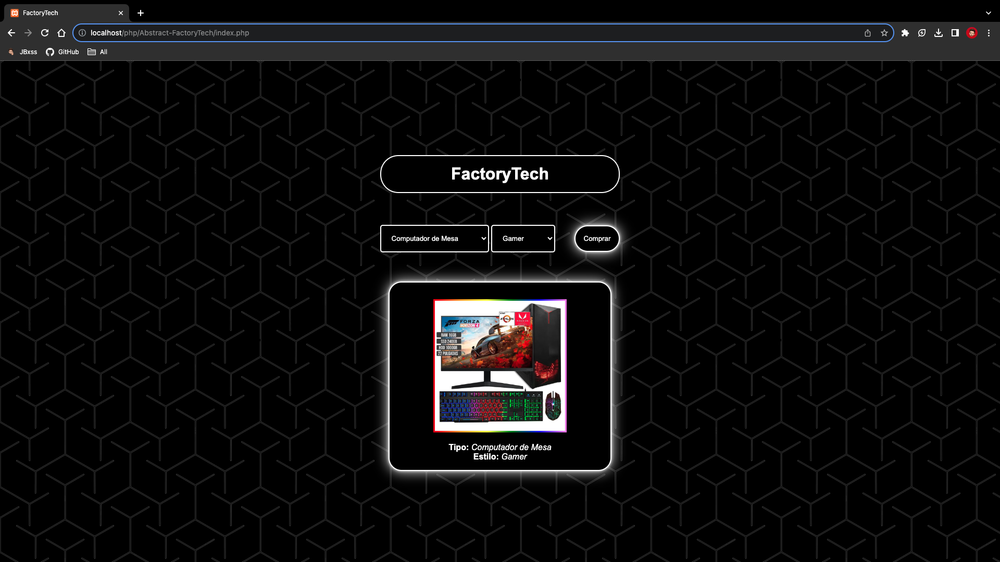

# Abstract FactoryTech

## Descripción

Abstract FactoryTech es una fábrica de tecnología desarrollada en PHP que utiliza el patrón de diseño Abstract Factory para la creación de computadoras personalizadas. Este proyecto permite a los usuarios seleccionar el tipo de computadora que desean y genera una imagen que representa la fabricación de la PC basada en esa elección.

## Capturas de Pantalla


*Página de Inicio de FactoryTech*

## Funcionalidades

- **Selección de Tipo de Computadora**: Los usuarios pueden elegir entre dos tipos de computadoras: "Gamer" o "Profesional".

- **Generación de Imagen**: Una vez seleccionado el tipo de computadora, la aplicación generará una imagen que muestra el proceso de fabricación de la computadora seleccionada.

## Patrón de Diseño Abstract Factory

Abstract FactoryTech es un ejemplo de implementación del patrón de diseño Abstract Factory. Este patrón permite la creación de familias de objetos relacionados sin especificar sus clases concretas. En este caso, la fábrica abstracta crea componentes de computadora (como CPU, GPU, RAM, etc.) según la categoría seleccionada.

## Ejemplo de Uso

```php
// Crear una fábrica para computadoras gamer
$gamerFactory = new GamerComputerFactory();
$gamerComputer = $gamerFactory->createComputer();

// Crear una fábrica para computadoras profesionales
$professionalFactory = new ProfessionalComputerFactory();
$professionalComputer = $professionalFactory->createComputer();
```

## Requisitos

- PHP 7.0 o superior.
- Servidor web (por ejemplo, Apache) para ejecutar la aplicación.

## Instalación

1. Clona este repositorio en tu servidor web local o en tu servidor de producción:

   ```bash
   git clone https://github.com/JBxss/Abstract-FactoryTech.git
   ```

2. Configura tu servidor web para que el directorio raíz apunte a la carpeta donde clonaste el repositorio.

3. Abre un navegador web y accede a la URL de tu servidor para comenzar a usar Abstract FactoryTech.

---

¡Gracias por usar Abstract FactoryTech! Esperamos que esta fábrica de tecnología te ayude a comprender mejor el patrón de diseño Abstract Factory y a crear computadoras personalizadas de forma sencilla. Si tienes preguntas o problemas, no dudes en abrir un problema o enviar una solicitud de extracción. ¡Disfruta de la creación de computadoras personalizadas!